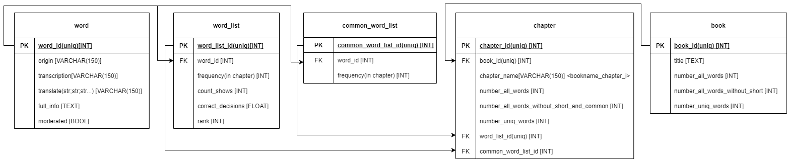

## Database structure

- word - table contain en-ru word dict
    - origin - english word
    - transcription
    - translation - russian translation words
    - full_info - full information about translation
    - moderated - was word moderated manually

- word_list
    - word_id - foreign key on word table
    - frequency - how often the word have in chapter
    - count_shows - how often the word was shown
    - count_decisions - how often the correct answer was given
    - rank - [>=20,>=40,>60,>=80,>=100] the rank of the word depending on the ratio of the correct given
      answers to the number of impressions

- common_word_list
    - word_id - foreign key on word table
    - frequency - how often the word have in chapter
  
- chapter
    - book_id - foreign key on book table
    - chapter_name - name of chapter like _bookname_ \_chapter_ _number_
    - number_all_words
    - number_all_words_without_short_and_common - short words are shorter than 3 chars, and have frequency bigger than 100  
    - number_uniq_words - number all unique words in chapter
    - word_list_id - foreign key on word list table
    - common_word_list - foreign key on common word list table

- book
    - title
    - number_all_words - in book
    - number_all_words_without_short - in book
    - number_uniq_words - in book

